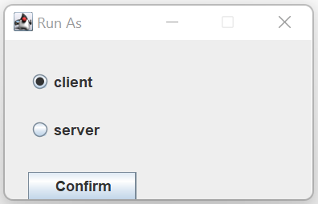
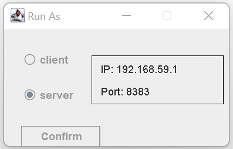
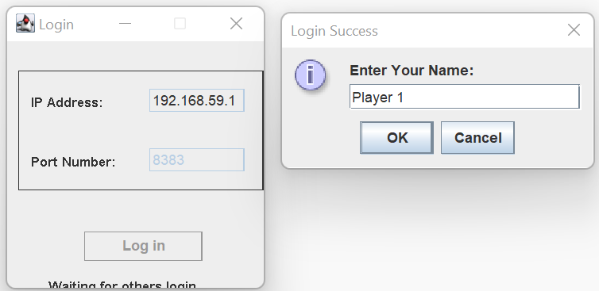
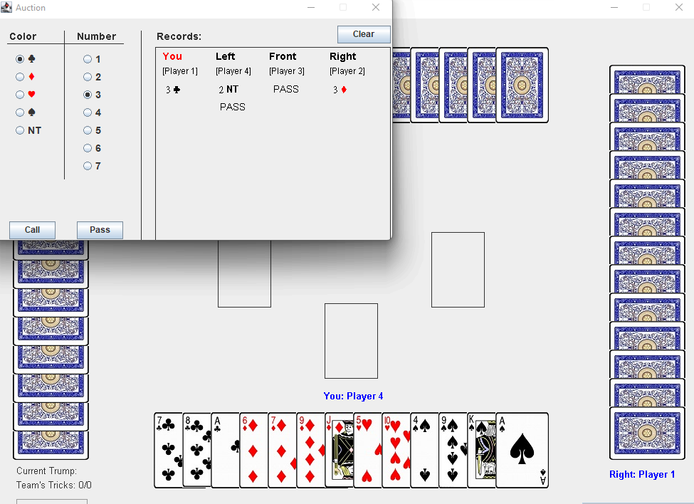
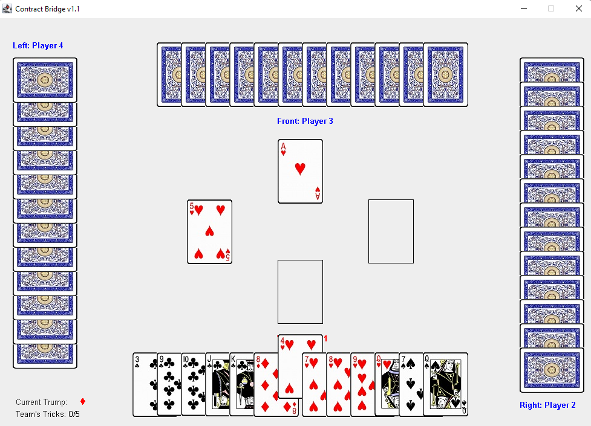

# Online Contract Bridge Game
### Author: Hao-Jen Wang
### Date Done: November 26, 2014

This game is created during the course "Software Studio" (CS-241001) at National Tsing Hua University.

To run this game, 1 server is required to create the TCP socket, and should accept 4 clients (players).

The UI components are implemented using Swing, and here are some sample screenshots:

| Stage | User Interface  |
|:-:|:-:|
| Login Panel |  |
| Server Login |  |
| Client Login |  |
| The Bidding |  |
| The Play |  |